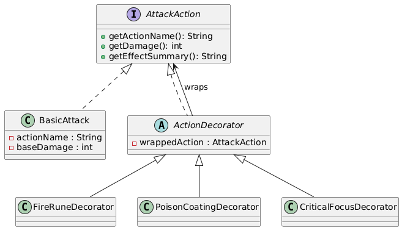
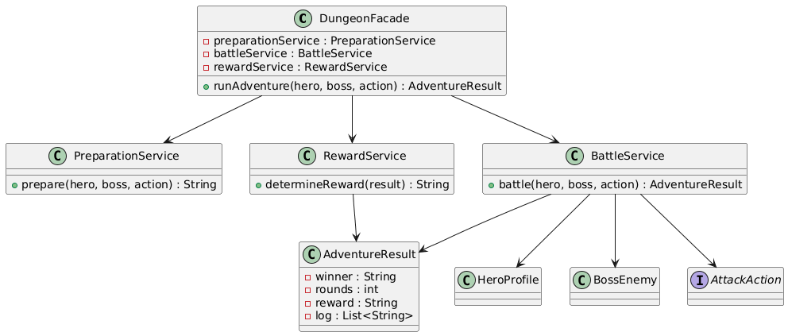

# Homework 5: RPG Dungeon Run - Decorator + Facade

## Overview
This assignment continues the RPG theme with a new challenge level. You will design a dungeon run system that is intentionally under-implemented so you must make sound architectural decisions yourself.

Your job is to use:
- **Decorator** to add runtime upgrades to attacks
- **Facade** to hide dungeon workflow complexity behind one simple interface

## What You Will Build
- A base attack abstraction with stackable enhancements
- A facade that coordinates preparation, battle, and reward flow
- A demo that proves both design patterns clearly

## Patterns and Roles
- **Decorator**: extend a base attack at runtime without creating a class for every combination
- **Facade**: expose one simple dungeon entry point while hiding subsystem details

## Connection to Previous Homework
- HW3 focused on integration with Singleton + Adapter
- HW4 focused on structural flexibility with Bridge + Composite
- HW5 focuses on runtime feature composition and simplified subsystem orchestration

## Requirements at a Glance
- Implement Decorator with at least 3 concrete decorators
- Implement Facade with meaningful subsystem coordination
- Keep `Main.java` focused on high-level usage
- Demonstrate multiple valid decorator combinations
- Demonstrate one full dungeon run through the facade
- Provide UML diagrams for Decorator and Facade

## Running the Project
```powershell
javac -d out (Get-ChildItem -Recurse -Filter *.java src | ForEach-Object { $_.FullName })
java -cp out com.narxoz.rpg.Main
```

## Project Structure
```text
homework-rpg-5/
├── src/
│   └── com/
│       └── narxoz/
│           └── rpg/
│               ├── Main.java
│               ├── decorator/
│               ├── facade/
│               ├── hero/
│               ├── enemy/
│               └── hints/
├── ASSIGNMENT.md
├── QUICKSTART.md
├── FAQ.md
├── STUDENT_CHECKLIST.md
└── README.md
```

## Deliverables
- Completed Java code
- UML diagrams (2)
- Clear console demo

### Decorator


### Facade


## Ссылка на код
https://github.com/zarina-kulm/homework-rpg-5

Read `ASSIGNMENT.md` before you start coding.
